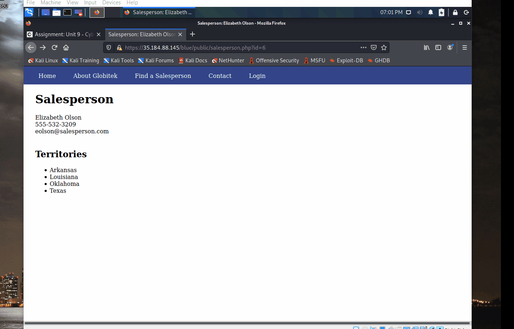
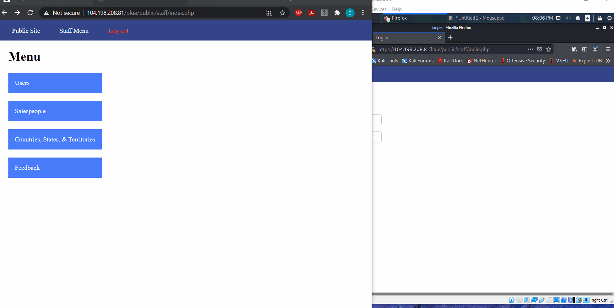
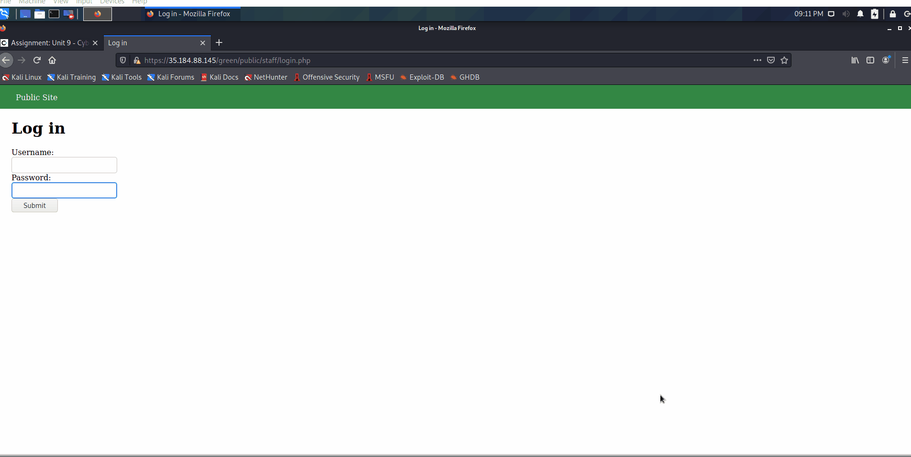
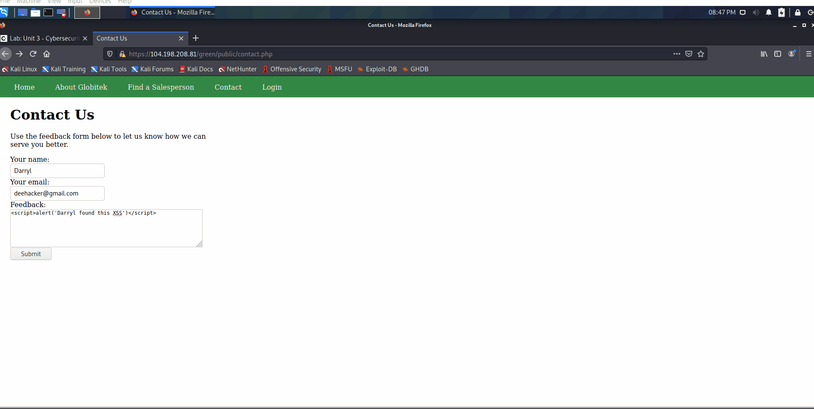
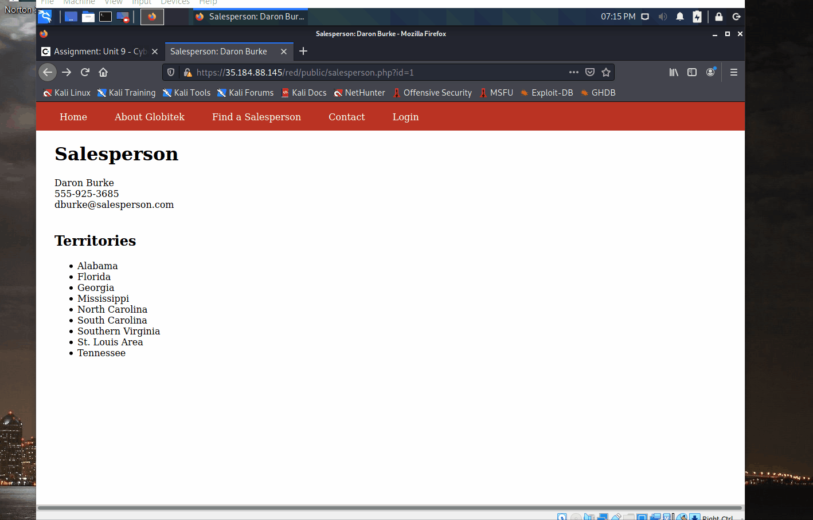

# Project 8 - Pentesting Live Targets

Time spent: 14 hours spent in total

> Objective: Identify vulnerabilities in three different versions of the Globitek website: blue, green, and red.

The six possible exploits are:

* Username Enumeration
* Insecure Direct Object Reference (IDOR)
* SQL Injection (SQLi)
* Cross-Site Scripting (XSS)
* Cross-Site Request Forgery (CSRF)
* Session Hijacking/Fixation

Each color is vulnerable to only 2 of the 6 possible exploits. First discover which color has the specific vulnerability, then write a short description of how to exploit it, and finally demonstrate it using screenshots compiled into a GIF.

## Blue

Vulnerability #1: SQL Injection (SQLi)

Description: Once at the "Find a Salesperson" page, it is possible to insert an URL encoded injection (' OR SLEEP(10)=0--') as the page id. The page will pause for a while then send you to the page with the id of 1/id=1. 

Vulnerability #2: Session Hijacking/Fixation

Description: Session ID can be transferred/changed giving access to an unauthorized individual. 

## Green

Vulnerability #1: User Enumeration 

Description: The "wrong password" error message displays a different text style depending on if the user is in the database or not. The error message for actual users appear in bold letters. 

Vulnerability #2: Cross-Site Scripting (XSS)

Description: It is possible to add XSS script to the "Contact Us" form. Script will then be executed once the "Feedback" page is opened.

## Red

Vulnerability #1: IDOR

Description: It is possible to edit the page id of the "Find a Salesperson" page until you can find a secret/hidden salesperson (id=10).

Vulnerability #2: __________________

Description:

## Notes

Describe any challenges encountered while doing the work
